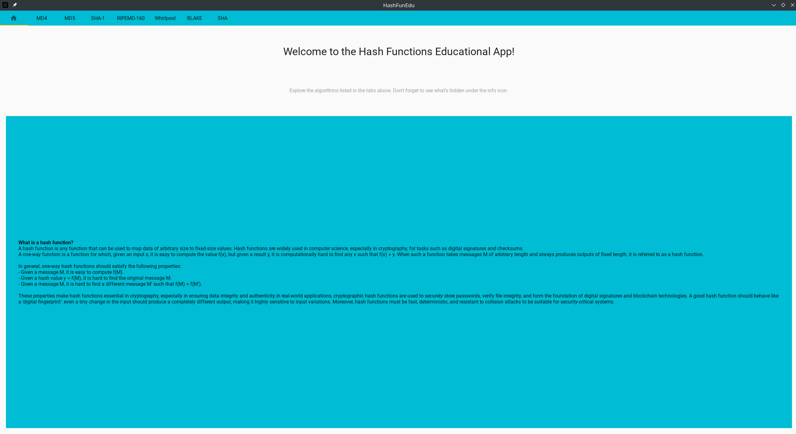
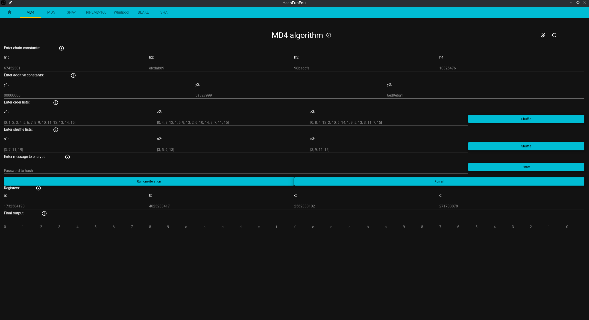
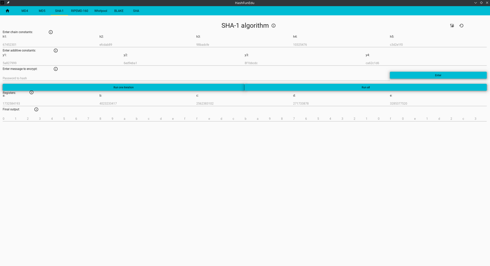
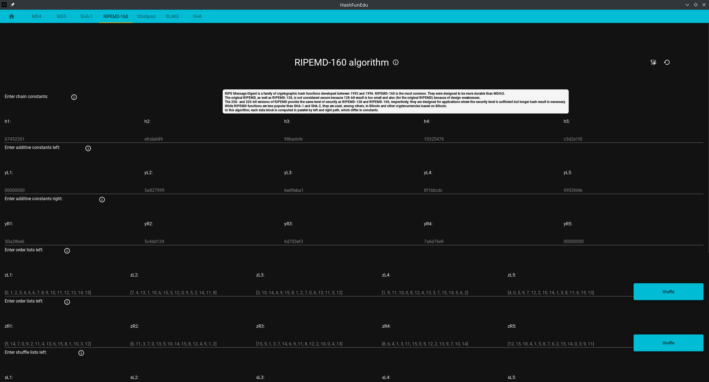

# Cryptography Hash Functions Educational App
This app was created for university project.

### How to run it?
1. Install required packages `pip install -r requirements.txt`
2. Run `gui.py`

### How to navigate?
The app is intuitive. \
Switch between tabs by clicking one of them. \
Toggle dark mode by clicking icon in the top right corner. \
Reset the variables by clicking "restart" icon also in the top right corner. \
**Hover over the "info" icon to see its descriptiond and find information.**

### Screenshots

#### Home

#### MD4 and MD5

#### SHA-1

#### RIPEMD-160

